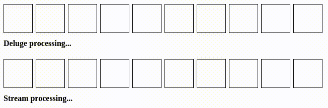

# Deluge, is not a Stream

Rust's streams drive and evaluate items sequentially.
While this is a simple analog of Iterators, it causes asynchronous operations to take much more time than expected because each future is only driven after the prior one returns a result.
This library aims to invert that pattern by driving the underlying features concurrently or in parallel, to the desired level of concurrency and parallelism.
At the same time all the complexity is hidden away from the users behind well known Iterator-like operations.



**This library is still experimental, use at your own responsibility**

### Design decisions

This is an opinionated library that puts ease of use and external simplicity at the forefront.
Operations that apply to individual elements like maps and filters **do not** allocate.
They result in simply wrapping each element in another future but they do not control the way these processed elements are evaluated.
It is the collector that controls the evaluation strategy.
At the moment there are two basic collectors supplied: a concurrent and a parallel one.

The concurrent collector accepts an optional concurrency limit.
If it is specified, at most the number of futures equal to that limit will be evaluated.

```rust
let result = deluge::iter([1, 2, 3, 4])
    .map(|x| async move { x * 2 })
    .collect::<Vec<usize>>(None)
    .await;

assert_eq!(vec![2, 4, 6, 8], result);
```

The parallel collector spawns a number of workers.
If a number of workers is not specified, it will default to the number of cpus, if the concurrency limit is not specified each worker will default to `total_futures_to_evaluate / number_of_workers`.
Note that you need to enable either a `tokio` or `async-std` feature to support parallel collectors.

```rust
let result = (0..150)
    .into_deluge()
    .map(|idx| async move {
        tokio::time::sleep(Duration::from_millis(50)).await;
        idx
    })
    .collect_par::<Vec<usize>>(None, None)
    .await;

assert_eq!(result.len(), 150);
```

Please take a look at [the tests](https://github.com/mkawalec/deluge/blob/main/src/lib.rs) for more examples of using the library.

### Questions

#### I would want to add another operation to DelugeExt. Should I?

By all means.
Please do not allocate on the heap in operations that transform individual elements.
Any operation you would find useful is fair game, contributions are welcome.

#### I found a performance improvement, should I submit a PR?

Absolutely!
As long the API exposed to the users does not get more complex, the number of allocations does not go up and intermediate memory usage does not increase.
Please open an issue first if you feel that breaking any of the above rules is absolutely neccessary and we will discuss.

### TODO:

- [x] Don't require `collect` to construct an intermediate vector
- [x] Add `fold`
- [x] Linting
- [x] Run tests for async-std as well
- [x] `fold_par`
- [_] Document
- [ ] Figure out why `filter` doesn't want to compile in tests
- [ ] Add `filter_map`
- [ ] Benchmark
- [ ] Folds shouldn't allocate a full intermediate vector of collected values